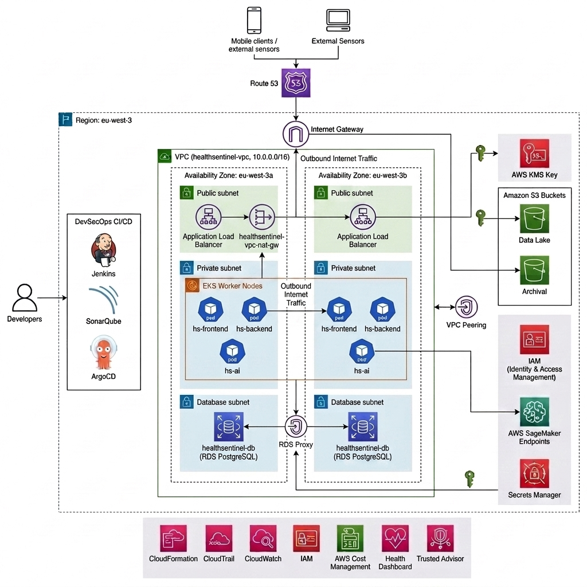

# 🏥 HealthSentinel — AWS Production Architecture Design

This document details the enterprise-grade, HIPAA-ready cloud infrastructure design for the HealthSentinel platform. The architecture is deployed in the **AWS Paris Region (eu-west-3)** and leverages **Amazon EKS**, **Amazon RDS**, **AWS KMS**, **IAM Roles for Service Accounts (IRSA)**, and **Amazon SageMaker** for secure clinical decision-support and patient telemetry monitoring.

---

## AWS Architecture Diagram

 
---
## 🗺️ System Overview & High-Level Topology

```text

AWS Cloud (Region: eu-west-3)
├── 🌐 Internet Gateway (IGW)
├── ⚡ NAT Gateway (15.224.78.255)
├── 👥 Internet / Clients
│   ├── 🩺 Clinical Users (Doctors/Nurses) [HTTPS Port 3000 / API Port 8000]
│   └── 🛠️ DevOps / CI/CD (Jenkins) [GitOps / ECR Push]
│
├── 🗺️ VPC: healthsentinel-vpc (10.0.0.0/16)
│   ├── 🔓 Public Subnets (10.0.1.0/24 & 10.0.2.0/24)
│   │   ├── ⚖️ Classic LB (Frontend) ──► Routes traffic to Port 3000
│   │   └── ⚖️ Classic LB (Backend)  ──► Routes /api traffic to Port 8000
│   │
│   ├── 🔒 Private Application Subnets (10.0.10.0/24 & 10.0.11.0/24)
│   │   └── ☸️ Amazon EKS Cluster: healthsentinel-cluster
│   │       └── 🖥️ Worker Nodes (t3.medium Autoscaling)
│   │           ├── 📦 hs-frontend Pod (Next.js) [Port 3000]
│   │           ├── 📦 hs-backend Pod (FastAPI)  [Port 8000]
│   │           └── 📦 hs-ai Pod (FastAPI ClusterIP) [Isolated Port 8000]
│   │               └── 🔄 Traffic Flows:
│   │                   ├── Frontend LB  ──► Port 80 -> 3000 ──► hs-frontend
│   │                   ├── Backend LB   ──► Port 80 -> 8000 ──► hs-backend
│   │                   └── Inter-Pod    ──► Local RPC 8000  ──► hs-backend to hs-ai
│   │
│   └── 🚫 Isolated Database Subnets (10.0.20.0/24 & 10.0.21.0/24)
│       └── 🗄️ RDS PostgreSQL 16 (healthsentinel-db) [JDBC/SQL TCP 5432]
│
├── 🛡️ IAM & Security Boundary
│   ├── 🔑 KMS Key (healthsentinel-cluster-key) [Secret/Volume Encryption]
│   └── 👤 IAM Roles (EKS, SageMaker, NodeGroup) [Assume Role Boundary]
│
├── 📦 Storage & Registries
│   ├── 🪣 S3 Bucket (sagemaker-eu-west-3-856021349334) ──► SageMaker ML Artifacts
│   ├── 🪣 S3 Bucket (healthsentinel-state-v2) ──────────► Terraform Remote State
│   └── 🏷️ ECR Repositories (Container Images)
│       ├── 🔹 healthsentinel-frontend
│       ├── 🔹 healthsentinel-backend
│       └── 🔹 healthsentinel-api (hs-ai Engine)
│
└── 🧠 SageMaker ML Service
    ├── 🖥️ SageMaker Studio (Development Workbench)
    ├── 🧠 SageMaker Model (Serialized Scikit-Learn Pipeline)
    └── ⚡ SageMaker Endpoint (healthsentinel-dev-endpoint) [HTTPS API Inference]
```
---

## 🌐 1. Networking & VPC Infrastructure

The platform resides in a custom-built, highly available **Virtual Private Cloud (VPC)** spanned across two Availability Zones (AZs) in **eu-west-3**.

| Parameter | Configuration | Details |
|-----------|---------------|---------|
| **VPC Name** | `healthsentinel-vpc` | Multi-AZ architecture optimized for high-availability. |
| **CIDR Block** | `10.0.0.0/16` | Provides 65,536 private IP addresses. |
| **Availability Zones** | `eu-west-3a`, `eu-west-3b` | Paris region deployment. |
| **DHCP Options** | `dopt-0088cbd0acebf7e7e` | Enforces `eu-west-3.compute.internal` and AmazonProvidedDNS. |

### Subnet Layout
```text

VPC CIDR: 10.0.0.0/16
│
├── Public Subnets (Ingress / ELBs / NAT)
│ ├── eu-west-3a: 10.0.1.0/24 [subnet-0b4502ffcd323c62e] (Tagged: kubernetes.io/role/elb = 1)
│ └── eu-west-3b: 10.0.2.0/24
│
├── Private Application Subnets (EKS Worker Nodes / Pods)
│ ├── eu-west-3a: 10.0.10.0/24 [subnet-0e060bb9ddce59ab1] (Tagged: kubernetes.io/role/internal-elb = 1)
│ └── eu-west-3b: 10.0.11.0/24 [subnet-0f782c5f15f0388d2]
│
└── Private Database Subnets (Isolated RDS Clusters)
├── eu-west-3a: 10.0.20.0/24
└── eu-west-3b: 10.0.21.0/24
```


### Gateways & Routing

- **Internet Gateway (IGW):** Enforces entry and egress for internet-facing traffic.
- **NAT Gateway:** `nat-06791c6c45f8f4ea5` located in Public Subnet `eu-west-3a` with Elastic IP `15.224.78.255`. Provides secure outbound internet access for private subnet instances (for pulling packages and security patches).
- **Route Tables:**
  - `healthsentinel-vpc-public` (`rtb-032a10be7e9f3339d`): Routes `0.0.0.0/0` traffic directly to the Internet Gateway.
  - `healthsentinel-vpc-private` (`rtb-0bea0fe43b006900f`): Routes `0.0.0.0/0` traffic to the NAT Gateway (`nat-06791c6c45f8f4ea5`). Attached to application and database subnets.

---

## ☸️ 2. Amazon EKS (Elastic Kubernetes Service)

The compute orchestrator is **Amazon EKS** configured with Auto Mode Node Groups, deploying containerized frontend, backend, and machine learning endpoints.

| Component | Specification | Description |
|-----------|---------------|-------------|
| **Cluster Name** | `healthsentinel-cluster` | Kubernetes control plane. |
| **K8s Version** | 1.30 | Supported release with extended maintenance. |
| **Node Group** | `initial` | Managed Node Group in private subnets. |
| **Instance Type** | `t3.medium` | 2 vCPUs, 4 GiB Memory, EBS-Optimized. |
| **Autoscaling** | Min: 1, Max: 5, Desired: 2 | Dynamically scales based on CPU/Memory load. |
| **Storage Class** | `gp3` (EBS CSI Driver) | Volume provisioning for persistent storage. |
| **OIDC Provider** | `ZA89BEC4AA00C06D581D1BF554FB27E2` | Enables IAM Roles for Service Accounts (IRSA). |

### EKS Cluster Workloads (Pods & Services)
```text

EKS Namespace: default
│
├── Pod: healthsentinel-frontend (Next.js 16 UI Dashboard)
│ ├── Port: 3000
│ └── Service: healthsentinel-frontend-svc (Type: LoadBalancer -> creates Classic Load Balancer)
│
├── Pod: healthsentinel-backend (FastAPI REST & WebSocket Server)
│ ├── Port: 8000
│ └── Service: healthsentinel-backend-svc (Type: LoadBalancer -> routes /api and WebSockets)
│
└── Pod: healthsentinel-ai (Scikit-Learn NEWS2 prediction service)
├── Port: 8000
└── Service: healthsentinel-ai-service (Type: ClusterIP -> isolated internally)

```

---

## 🗄️ 3. Amazon RDS PostgreSQL Database

Data persistence is handled by an isolated, secure database instance inside the database subnets, restricted from direct internet access.

- **Instance Identifier:** `healthsentinel-db`
- **Engine:** PostgreSQL 16
- **Instance Class:** `db.t3.micro` (Burstable DB instance, 1 vCPU, 1 GiB RAM)
- **Subnet Group:** `healthsentinel-db-subnet-group` (spanning database subnets `10.0.20.0/24` and `10.0.21.0/24`)
- **Security Group:** `healthsentinel-db-sg` (Ingress rules allow traffic only from the EKS Node Security Group on TCP port 5432)

---

## 🧠 4. Amazon SageMaker (Machine Learning Environment)

HealthSentinel integrates a professional MLOps workflow to train and deploy patient risk models.

- **SageMaker Studio Domain:** Deployed workspace for data scientists to design models.
- **SageMaker Model:** Trained Scikit-Learn clinical risk model (`sagemaker-scikit-learn` package).
- **SageMaker Endpoint:** `healthsentinel-dev-endpoint`
  - **Status:** `InService`
  - **Instance Type:** `ml.m5.xlarge` (Provides high CPU performance for continuous clinical inference)
  - **Purpose:** Exposes predictive REST endpoints for clinical risk metrics using vital signs.

---

## 🔒 5. IAM Roles, Policies & KMS Key

Access controls conform to the **Principle of Least Privilege (PoLP)**.

### Key Management Service (KMS)

- **Key Alias/ID:** `ccfd99b2-7f73-4ed1-b476-435040d307cb`
- **Description:** `healthsentinel-cluster` cluster encryption key
- **Purpose:** Encrypts Kubernetes secrets, RDS database storage, and S3 bucket contents.
- **Key Policy:** Configured to delegate admin rights to AWS Account administrators and runtime decryption access to the EKS cluster role and SageMaker execution role.

### Critical IAM Roles & Trusted Entities
```text

AWS IAM Boundary
│
├── Role: healthsentinel-cluster-cluster-... (EKS Control Plane Role)
│ ├── Trusted Entity: eks.amazonaws.com
│ └── Policies: AmazonEKSClusterPolicy, AmazonEKSVPCResourceController
│
├── Role: initial-eks-node-group-... (EKS Node Execution Role)
│ ├── Trusted Entity: ec2.amazonaws.com
│ └── Policies: AmazonEKSWorkerNodePolicy, AmazonEKS_CNI_Policy,
│ AmazonEC2ContainerRegistryReadOnly, AmazonEBSCSIDriverPolicy
│
└── Role: AmazonSageMakerAdminHTMLexecutionRole (SageMaker Pipeline Role)
├── Trusted Entity: sagemaker.amazonaws.com
└── Policies: AmazonSageMakerFullAccess, AmazonS3FullAccess
(Restricted to healthsentinel buckets)

```

---

## 🪣 6. S3 Storage & Container Registries (ECR)

Amazon S3 buckets and Amazon ECR house assets and secure Docker images:

### S3 Buckets

- **`sagemaker-eu-west-3-856021349334`:** Stores training artifacts, model binaries (`.tar.gz`), and evaluation metrics for SageMaker pipelines.
- **`wael-toukebri-healthsentinel-state-v2`:** Holds application configuration templates, environment files, and Terraform remote state backends.

### ECR Repositories

- **`healthsentinel-frontend`:** Houses Next.js 16 container images.
- **`healthsentinel-backend`:** Houses FastAPI API gateway container images.
- **`healthsentinel-worker`:** Houses background batch-processing workers.
- **`healthsentinel-api` / `healthsentinel-ai`:** Houses the Scikit-Learn inference microservice container images.

---

## 🔄 7. CI/CD DevSecOps Pipeline & GitOps
```text


HealthSentinel integrates security scanning gates directly into the delivery pipeline before deploying to the Kubernetes cluster.
[ Git Push ]
│
▼
[ Jenkins Pipeline ]
│
├── Gitleaks (Secrets scanning)
├── Bandit (Python SAST)
├── Hadolint (Dockerfile linting)
├── Trivy (Vulnerabilities scan)
├── SonarQube (Quality Gate & Coverage)
│
└───> Build & Push to Amazon ECR
│
└───> ArgoCD (GitOps Pull & Deploy to EKS)

```

- **Jenkins (DevSecOps Orchestration):** Listens for push events, builds packages, runs quality checks, and generates software bill of materials (SBOM) profiles.
- **SonarQube Quality Gate:** Enforces a strict minimum of **80% unit test coverage** and checks for security hotspots.
- **ArgoCD:** Pulls modified manifests from the repository and synchronizes them to the production `healthsentinel-cluster` in EKS.

---

## 📊 Summary

HealthSentinel's AWS architecture delivers a **secure, scalable, and HIPAA-ready** platform for clinical decision support. By leveraging managed AWS services like EKS, RDS, and SageMaker, the platform achieves:

- **High Availability** through multi-AZ deployment
- **Security** via KMS encryption, IAM least-privilege access, and isolated subnets
- **Scalability** through EKS auto-scaling and managed database services
- **MLOps Integration** with SageMaker for continuous model training and deployment
- **DevSecOps** with automated security scanning and GitOps deployment

---

*Last Updated: 2026*
