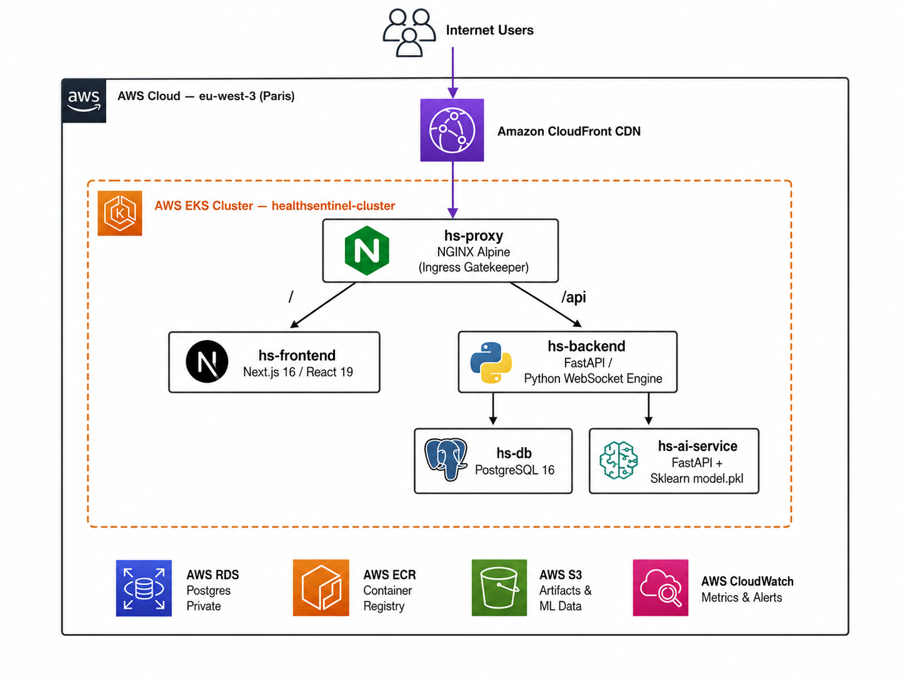
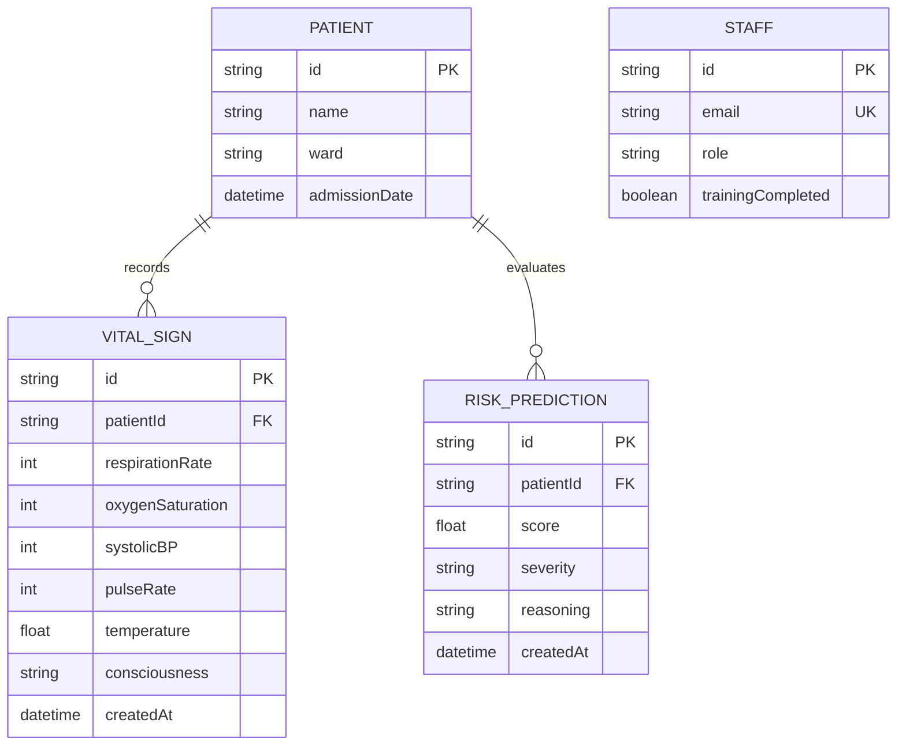

# 🏥 HealthSentinel — AI-Driven Clinical Risk & Patient Safety Platform

<div align="center">

[](#)
[](#)
[](#)
[](#)

[](#)
[](#)
[](#)
[](#)

[](#)
[](#)
[](#)
[](#)
[](#)

[](#)
[](#)
[](#)
[](#)

[](#)
[](#)
[](#)

</div>

**An enterprise-grade, cloud-native platform for real-time patient risk monitoring, staff training compliance, and AI-powered clinical decision support — engineered for ICUs, Emergency Wards, and high-acuity healthcare environments.**

[🚀 Quick Start](#-local-development-guide) · [📖 API Docs](#-clinical-api-reference) · [🖼️ Gallery](#️-project-gallery) · [☁️ Deploy](#️-cloud-deployment-guide-production)

</div>

---

## 📋 Table of Contents

1. [The Problem & Solution](#-the-problem--solution)
2. [System Architecture](#️-system-architecture)
3. [Core Features](#-core-features)
4. [Technology Stack](#️-technology-stack)
5. [Database Schema](#-database-schema)
6. [DevSecOps CI/CD Pipeline](#-devsecops-cicd-pipeline)
7. [Code Quality & Security](#-code-quality--security)
8. [ML Layer & AI Integration](#-ml-layer--ai-integration)
9. [Cloud Infrastructure (Terraform)](#️-cloud-infrastructure-terraform)
10. [GitOps Deployment (ArgoCD)](#-gitops-deployment-argocd)
11. [Observability & Monitoring](#-observability--monitoring)
12. [Clinical API Reference](#-clinical-api-reference)
13. [Local Development Guide](#-local-development-guide)
14. [Cloud Deployment Guide](#️-cloud-deployment-guide-production)
15. [Project Gallery](#️-project-gallery)
16. [Enterprise Roadmap](#-enterprise-roadmap)
17. [Repository Structure](#-repository-structure)

---

## 🔬 The Problem & Solution

### The Problem

Hospitals and clinics face a two-front operational crisis:

- **Patient Safety Gaps** — Clinical deterioration often goes undetected until it becomes a life-threatening emergency. Traditional monitoring relies on periodic manual assessments, introducing dangerous gaps in continuous observation.
- **Staff Readiness Deficits** — Medical teams struggle to maintain up-to-date certifications and protocol training. Compliance gaps are discovered reactively, not proactively, putting both patients and institutions at risk.
- **Disconnected Systems** — Risk data, staff performance metrics, and safety dashboards exist in silos. There is no unified platform giving medical leadership a real-time, actionable view of both patient acuity and staff readiness simultaneously.

### The Solution

**HealthSentinel** bridges this gap. It is a unified AI-driven platform that:

1. **Continuously streams and evaluates patient vital signs** via secure WebSockets (every 0.8 seconds), feeding them into an ML inference engine that predicts deterioration risk using the **NEWS2 clinical protocol**.
2. **Tracks staff training compliance and certifications**, using ML to recommend targeted training modules based on patient risk profiles and skill gaps.
3. **Delivers real-time, actionable dashboards** that give charge nurses, ICU directors, and hospital administrators a single pane of glass showing patient acuity, staff readiness, and system health — simultaneously.
4. **Automates the entire engineering pipeline** with a battle-hardened DevSecOps CI/CD system, ensuring every deployment is security-scanned, quality-gated, and automatically rolled out to a production AWS EKS cluster.

### The Impact

> *Medical teams get real-time dashboards showing staff readiness, compliance gaps, and predicted high-risk cases — actionable insights to prevent incidents before they occur.*

| Stakeholder | Before HealthSentinel | After HealthSentinel |
|:---|:---|:---|
| **ICU Nurse** | Manual vitals charting every 2–4 hours | Live 0.8s telemetry stream with automated alarm |
| **Charge Nurse** | Reactive response to deterioration | Proactive AI alert 2–4 hours before crisis |
| **Hospital Admin** | Monthly compliance reports | Real-time staff certification dashboard |
| **Clinical Director** | Siloed data in multiple systems | Unified risk + readiness command center |
| **DevOps Engineer** | Manual deployments, no security gate | Fully automated 10-stage DevSecOps pipeline |

---

## 🏗️ System Architecture

### High-Level Cloud Architecture




### Component Breakdown

| Service | Container | Technology | Responsibility |
|:---|:---|:---|:---|
| **Frontend** | `hs-frontend` | Next.js 16, React 19, TypeScript, Tailwind CSS v4, Zustand, Framer Motion, Chart.js, Recharts | Admin & Staff dashboards, WebSocket telemetry client, ECG charts, audio alarm system |
| **Backend API** | `hs-backend` | Python 3.12, FastAPI, Uvicorn, Pydantic v2, Prisma Client Python | REST API, ClinOps WebSocket engine, patient vitals simulation, AI service orchestration |
| **AI Inference** | `hs-ai-service` | FastAPI, Scikit-Learn, NumPy, Joblib | Isolated ML inference microservice; exposes `/predict` endpoint with a trained clinical risk classifier |
| **Database** | `hs-db` | PostgreSQL 16, Prisma Schema (dual JS + Python clients) | Persistent storage for patients, vitals history, risk predictions, staff records |
| **Reverse Proxy** | `hs-proxy` | NGINX Alpine | Single ingress gatekeeper — routes HTTPS/WSS traffic, SPA fallback |
| **CI/CD** | `hs-jenkins` | Jenkins LTS | Automated 10-stage DevSecOps pipeline |
| **Code Quality** | `hs-sonarqube` | SonarQube Community | Static analysis, coverage reporting, quality gate enforcement |

---

## ⚡ Core Features

### 🔴 Real-Time Patient Telemetry
Low-latency vital signs streaming via asynchronous **FastAPI WebSockets**, pushing updates every **0.8 seconds**. The WebSocket engine simulates ECG waveforms with a 10-point template and applies clinical status cycles (Critical → Stable → Warning → Critical), driving the frontend telemetry charts and alarm systems.

### 🧠 AI Deterioration Indexing (NEWS2 Protocol)
A trained **Scikit-Learn classifier** evaluates all six National Early Warning Score 2 parameters in real time:

| Parameter | NEWS2 Scoring Range | Clinical Risk |
|:---|:---|:---|
| **Respiratory Rate** | 0–3 points | Tachypnea / apnea |
| **Oxygen Saturation (SpO₂)** | 0–3 points | Hypoxia |
| **Systolic Blood Pressure** | 0–3 points | Hypotension / hypertension |
| **Pulse Rate** | 0–3 points | Bradycardia / tachycardia |
| **Consciousness (ACVPU)** | 0–3 points | Neurological deterioration |
| **Temperature** | 0–3 points | Hypothermia / fever |

A total NEWS2 score of **≥7** triggers an urgent escalation response in the HealthSentinel alarm system.

### 🚨 Intelligent Emergency Alarms
- Audio alarm (`emergency-alarm.mp3`) auto-triggers when any patient exceeds a critical threshold
- Interactive UI alarm panel with per-patient severity indicators
- Graceful AI fallback mode: if `hs-ai-service` is unreachable, the backend applies rule-based threshold logic to maintain clinical safety

### 📋 Staff Training & Compliance Tracking
- Track training completion rates and certifications per staff member
- ML-recommended training modules based on patient risk profiles and staff skill gaps
- Gamified dashboards: leaderboard, progress bars, and completion notifications

### 🌐 HIPAA-Ready Architecture
- NGINX enforces all inbound traffic routing; database ports are never publicly exposed
- AES-256 encryption at rest and TLS in transit
- All secrets managed via Jenkins credentials vault (zero hardcoded keys)
- Role-Based Access Control (RBAC): Admin, Doctor, Nurse

### 🚀 Full GitOps Deployment
Every `git push` to `main` triggers a Jenkins pipeline that security-scans, quality-gates, builds, pushes to ECR, and rolls out to production EKS — fully automated.

### 🛡️ End-to-End DevSecOps
10-stage Jenkins pipeline with Gitleaks, Bandit, Hadolint, Trivy SBOM + CVE scanning, SonarQube quality gate, and ArgoCD GitOps reconciliation.

---

## 🛠️ Technology Stack

HealthSentinel is built on a highly modular, decoupled, and containerized architecture designed for 99.9% uptime and low-latency data processing:


- **Frontend Application**:
  - **Framework**: Next.js 16 (App Router) & React 19 for rendering optimization and server-side safety layers.
  - **Styling**: Tailwind CSS for responsive layouts and Shadcn/ui component primitive libraries.
  - **State Management**: Zustand for localized store management and WebSocket data synchronization.
  - **Visualization**: Recharts & Chart.js for real-time cardiac ECG waves and historical telemetry parameters.
  - **Animations**: Framer Motion for smooth transitions between dashboard layouts.

- **Backend Application API**:
  - **Framework**: FastAPI (Python 3.12) utilizing asynchronous coroutines (`asyncio`) for low-latency WebSockets.
  - **ORM**: Prisma Client Python for type-safe database queries.
  - **Reverse Proxy**: NGINX Alpine acting as a gateway proxy for path routing and SSL termination.

- **AI Inference Microservice**:
  - **Framework**: FastAPI serving Scikit-Learn classifiers.
  - **Prediction System**: Dedicated endpoints validating vital inputs via Pydantic schemas and returning predictive deterioration scores.

- **Database & Storage**:
  - **Engine**: PostgreSQL 16 (running on AWS RDS in production, containerized locally).

- **Observability & Logging**:
  - **Metrics**: Prometheus & Grafana for time-series charts.
  - **Logging**: Grafana Loki & Promtail for aggregated cluster and application log querying.
  - **Infrastructure**: AWS CloudWatch for host CPU and disk metrics.

---

## 🗄️ Database Schema

The persistence layer is managed via PostgreSQL, using Prisma ORM to auto-generate migrations and client libraries for Javascript/Python:



### Table Definitions

1. **`Patient`**: Holds critical demographic information and administrative ward classification.
2. **`VitalSign`**: Tracks continuous clinical vitals conforming to NEWS2 specifications (Respiration, SpO2, Systolic Blood Pressure, Pulse Rate, Temperature, Consciousness/AVPU).
3. **`RiskPrediction`**: Logs prediction records generated by the ML engine, including explainability strings (SHAP).
4. **`Staff`**: Stores authentication identifiers, user access control roles (`ADMIN`, `DOCTOR`, `NURSE`), and training/certification status.

---

## 🔄 DevSecOps CI/CD Pipeline

The pipeline is implemented inside a unified [Jenkinsfile](file:///c:/Users/wael4/Desktop/HealthSentinel/Jenkinsfile), orchestrating security scanners, testing tools, and Kubernetes deployment binaries:

### Pipeline Execution Flow


- **Jenkins Integration**:
  - Automatically triggered by GitHub webhooks.
  - Generates full software bill of materials (SBOM) in CycloneDX format for every container image.
  - Enforces build termination on high-severity vulnerabilities.

---

## 🔒 Code Quality & Security

We adopt a "Shift-Left" security philosophy where compliance checks run directly in the build pipeline:

- **Secret Leak Detection**: `Gitleaks` scans git histories to prevent credential uploads.
- **Static Security Scanning (SAST)**: `Bandit` scans Python microservices to identify insecure modules.
- **Dockerfile Best Practices**: `Hadolint` enforces non-root run architectures and pinned base image tags.
- **Container Vulnerability Auditing**: `Trivy` scans built images for OS CVEs and packages.
- **SonarQube Quality Gate**:
  - Tracks code duplication, code smells, bugs, and technical debt.
  - Enforces a quality threshold requiring a minimum of **80% unit test coverage** and **0 critical issues**.

---

## 🧠 ML Layer & AI Integration

The risk prediction model is served by a decoupled microservice (`hs-ai-service`) inside the EKS cluster:

- **Model Training**: A Scikit-Learn model is trained on simulated patient parameters and compiled to a serialized file (`model.pkl`).
- **Inference Pipeline**:
  - The backend sends a payload containing respiration, SpO2, and systolic blood pressure values to `hs-ai-service`.
  - The model outputs a predicted deterioration index (0.0 to 1.0) and translates it into a risk level (`LOW`, `MEDIUM`, `HIGH`).
- **Resilient Fallback Mode**: If the AI model container is offline, the backend dynamically applies rule-based NEWS2 threshold logic to prevent system failures.

---

## ☁️ Cloud Infrastructure (Terraform)

All AWS cloud resources are provisioned as code using **Terraform** inside the [terraform](file:///c:/Users/wael4/Desktop/HealthSentinel/terraform) directory:

- **Networking VPC**: Configures public, private, and private database subnets across three availability zones.
- **AWS EKS Cluster**: Runs microservices with autoscaling node groups and Fargate capabilities.
- **AWS RDS PostgreSQL**: Databases are isolated in private subnets, restricting network exposure to EKS worker node security groups.
- **AWS ECR Registries**: Houses secure Docker images for backend, frontend, and AI services.

---

## 🚢 GitOps Deployment (ArgoCD)

HealthSentinel utilizes **ArgoCD** for continuous deployment and self-healing cluster synchronization:

- **Declarative Manifests**: Kubernetes resource files are located in the [k8s](file:///c:/Users/wael4/Desktop/HealthSentinel/k8s) folder.
- **Self-Healing Reconciliation**: ArgoCD continuously monitors changes in the repository. When new image tags are pushed to EKS by the Jenkins pipeline, ArgoCD automatically triggers rolling updates to sync the cluster state.

---

## 📊 Observability & Monitoring

Enterprise-grade cluster visibility is achieved through a monitoring stack integrated into the AWS and EKS environments:

- **Prometheus**: Scrapes metrics from `/metrics` endpoints across active pods.
- **Grafana**: Visualizes cluster health, network bandwidth, traffic rates, and CPU/Memory loads.
- **Grafana Loki & Promtail**: Deployed via Helm charts for log aggregation. Promtail agents collect stdout/stderr logs from EKS pods and stream them into Loki for search-indexed log querying inside Grafana.
- **AWS CloudWatch**: Tracks infrastructure performance, EC2 CPU load, and EBS disk write operations.

---

## 📖 Clinical API Reference

### HTTP Endpoints

#### 1. Retrieve Active Patients
* **Route**: `GET /api/patients`
* **Response**:
  ```json
  [
    {
      "id": "4002",
      "name": "John Doe",
      "status": "Critical",
      "heartRate": 115,
      "riskScore": 88,
      "ward": "ICU-01",
      "respirationRate": 16,
      "oxygenSaturation": 98,
      "systolicBP": 122,
      "temperature": 36.8
    }
  ]
  ```

#### 2. Clinical Risk Inference
* **Route**: `POST /api/v1/inference/predict`
* **Payload**:
  ```json
  {
    "respirationRate": 22.0,
    "oxygenSaturation": 93.5,
    "systolicBP": 110.0
  }
  ```
* **Response**:
  ```json
  {
    "status": "success",
    "score": 0.82,
    "severity": "Critical",
    "reasoning": "Inference complete via internal AI Microservice"
  }
  ```

#### 3. Trigger Model Retraining
* **Route**: `POST /api/training/start`
* **Payload**:
  ```json
  {
    "action": "start"
  }
  ```
* **Response**:
  ```json
  {
    "status": "success"
  }
  ```

### WebSocket Stream

#### Live Telemetry Channel
* **Route**: `WS /ws/patients`
* **Frequency**: Pushes vital parameter updates every **0.8 seconds**.
* **Payload**: Streams simulated real-time vital sign arrays, including a 10-point ECG waveform vector for live heart rate charts.

---

## 🚀 Local Development Guide

### Prerequisites
- Docker & Docker Compose
- Node.js (v20+)
- Python (v3.12+)

### Running the Full Stack
1. Clone the repository and navigate to the root directory.
2. Initialize and configure the environment variables:
   ```bash
   cp .env.example .env
   ```
3. Start all services using Docker Compose:
   ```bash
   docker-compose up --build
   ```
4. Access the different dashboards:
   - **Frontend Command Center**: `http://localhost:3000`
   - **FastAPI API Documentation**: `http://localhost:8000/docs`
   - **SonarQube Panel**: `http://localhost:9000`
   - **Jenkins Dashboard**: `http://localhost:8081`

---

## ☁️ Cloud Deployment Guide (Production)

1. **Deploy the AWS Infrastructure**:
   ```bash
   cd terraform
   terraform init
   terraform apply -auto-approve
   ```
2. **Retrieve the EKS Kubeconfig**:
   ```bash
   aws eks update-kubeconfig --region eu-west-3 --name healthsentinel-cluster
   ```
3. **Configure ArgoCD Application**:
   ```bash
   kubectl apply -f k8s/argocd-app.yaml
   ```
4. **Trigger Jenkins Pipeline**:
   Commit your changes to trigger the webhook or run a build manually in the Jenkins console to build, scan, and deploy images to EKS.

---

---

## 🗺️ Engineering Roadmap & Future Horizons
HealthSentinel is actively maintained and built to scale. While **v1.0.0** establishes the baseline core microservices, monitoring infrastructure, and CI/CD pipelines, the following architectural enhancements are scheduled for upcoming releases:

- [ ] **v1.1.0 — Multi-Region High Availability (HA):** Migrate stateful storage backends to cross-region AWS Aurora replicas to ensure absolute disaster recovery compliance.
- [ ] **v1.2.0 — Enhanced DevSecOps Guardrails:** Integrate automated runtime security monitoring inside the EKS cluster utilizing Falco or AWS GuardDuty for real-time threat detection.
- [ ] **v2.0.0 — Advanced AI Integration:** Upgrade the SageMaker asynchronous inference endpoints to handle real-time streaming predictive clinical metrics with automated model data drift tracking.

## 🖼️ Project Gallery

### 🌐 System Observability & Monitoring
| Grafana Cluster Monitoring | Kubernetes Compute Pods |
| :---: | :---: |
|  <br> **Grafana: EC2 Worker CPU Load** |  <br> **Grafana: Pod Compute Resource Allocations** |
| **Kubernetes Networking** | **Traffic Rate Monitor** |
|  <br> **Grafana: Cluster Network Throughput** |  <br> **Grafana: Live API Traffic Rates** |
| **Pod Resource Consumption** | **Pod Capacity Limits** |
|  <br> **Grafana: CPU/Memory Resource Utilization** |  <br> **Grafana: Pod Capacity Limits & Load Logs** |

### ☁️ Infrastructure & Security Auditing
| AWS CloudWatch Dashboard | SonarQube Analysis Results |
| :---: | :---: |
|  <br> **CloudWatch: AWS EC2 Nodes CPU Load** |  <br> **SonarQube: Quality Gate Analysis (Passed)** |
| **SonarQube Gate Setup** | **Jenkins Builds** |
|  <br> **SonarQube: Quality Gate Conditions** |  <br> **Jenkins: Project Builds History Overview** |

### 🚀 Continuous Integration & API Docs
| Jenkins CI/CD Pipeline | API Endpoint Swagger UI |
| :---: | :---: |
|  <br> **Jenkins: Multi-Branch Pipeline Stages** |  <br> **Clinical API: Swagger docs (/api/training/start)** |
| **API Root Endpoint** | **API Staff & Patients Registry** |
|  <br> **Clinical API: Swagger docs (Root Endpoint)** |  <br> **Clinical API: Swagger docs (/api/staff & /api/patients)** |

### 🚢 GitOps Deployment State
| ArgoCD OutOfSync State | ArgoCD Synced and Healthy State |
| :---: | :---: |
|  <br> **ArgoCD: Pod Deployment Tree (OutOfSync state)** |  <br> **ArgoCD: Successful Deployment Tree (Synced & Healthy)** |


### 🎥 Flagship UI Demonstration
Watch the live client web application, WebSockets telemetry synchronization, alarm systems, SageMaker training workbench, and Kubernetes Control Plane dashboards:

👉 **[🔗 Click Here to Open the Walkthrough Video in a New Tab](https://github.com/user-attachments/assets/7f453924-42ab-4096-865f-20c1242cad93)**

<video src="https://github.com/user-attachments/assets/7f453924-42ab-4096-865f-20c1242cad93" controls="controls" muted="muted" style="max-width: 100%; display: block;"></video>

*(Note: If the streaming player above does not render immediately, GitHub's media servers may still be processing the high-resolution file. Please use the direct link above).

---

## 📈 Enterprise Roadmap

### 🏥 Phase 1: HIPAA/GDPR Alignment & Data Privacy
- **Business Associate Agreement (BAA)**: Setup production architectures strictly inside AWS accounts bound by a signed AWS BAA.
- **Least Privilege Access Control**: Implement IAM roles using MFA-forced policies, and utilize Kubernetes IAM Roles for Service Accounts (IRSA).
- **Data Encryption**: Enforce KMS-managed encryption keys for all PostgreSQL databases (RDS) and S3 storage buckets.
- **Transit Safety**: Enforce TLS 1.3 across all communication nodes and private subnets using VPC Interface Endpoints (PrivateLink).

### 🧪 Phase 2: Synthetic Clinical Sandbox
- **Synthea Simulator**: Ingest patient clinical records using Synthea to generate high-fidelity simulated patient cohorts.
- **OMOP CDM Alignment**: Map clinical data structures directly onto the OHDSI OMOP Common Data Model to ensure interoperability with systems like Epic or Cerner.

### 🔄 Phase 3: MLDLC Lifecycle & Explainable AI
- **MLflow Tracking**: Deploy a centralized MLflow server to track hyperparameters, model versions, and validation datasets.
- **Explainable Clinical Decisions**: Integrate SHAP (SHapley Additive exPlanations) values on patient profiles to provide clinical reasons behind alerts (e.g. drop in SpO2 combined with rise in respiratory rate).

### 🩺 Phase 4: Human-Centered Design for Stress
- **Three-Second Rule**: Optimize telemetry display contrast and semantic colors (Red for immediate crisis, Amber for warning, Green for stable) to prevent diagnostic delays.
- **WCAG Accessibility**: Integrate high-contrast text layers and redundant visual indicators for color-blind staff.

---

## 📁 Repository Structure

```
HealthSentinel
├── assets/
│   └── screenshots/
│       ├── AWS CloudWatch Console EC2 Nodes CPU Metrics.png - SonarQube UI Your specific Quality Gate CriteriaConditions.png         # Cluster, pipeline, and API screenshots
│       └── healthsentinel-demo-clean.mp4                 # Walkthrough video demo
├── healthsentinel-ai-service/
│   ├── Dockerfile
│   ├── main.py                   # FastAPI Scikit-Learn risk predictor
│   └── requirements.txt
├── healthsentinel-backend/
│   ├── Dockerfile
│   ├── main.py                   # FastAPI WebSocket telemetry engine
│   ├── create_model.py           # Model compilation script
│   ├── prisma/
│   │   └── schema.prisma         # PostgreSQL schema definition
│   └── requirements.txt
├── healthsentinel-frontend/
│   ├── src/
│   │   ├── app/
│   │   │   ├── page.tsx          # Landing Page
│   │   │   ├── dashboard/        # Live grid telemetry & detail views
│   │   │   ├── patients/         # Patient registries matrix
│   │   │   └── training/         # SageMaker Neural Workbench
│   │   ├── components/           # Bento boxes, charts & status cards
│   │   └── store/                # Zustand client state managers
│   ├── Dockerfile
│   └── package.json
├── k8s/
│   ├── ai.yaml                   # EKS AI deployment manifests
│   ├── backend.yaml              # EKS Backend deployment manifests
│   └── frontend.yaml             # EKS Frontend deployment manifests
├── terraform/
│   ├── main.tf                   # VPC, EKS, RDS infrastructure as code
│   ├── variables.tf
│   └── providers.tf
├── docker-compose.yml            # Full multi-container local stack
├── Jenkinsfile                   # Multi-stage security & deploy pipeline
├── nginx.conf                    # SPA Gateway routes config
└── README.md
```
